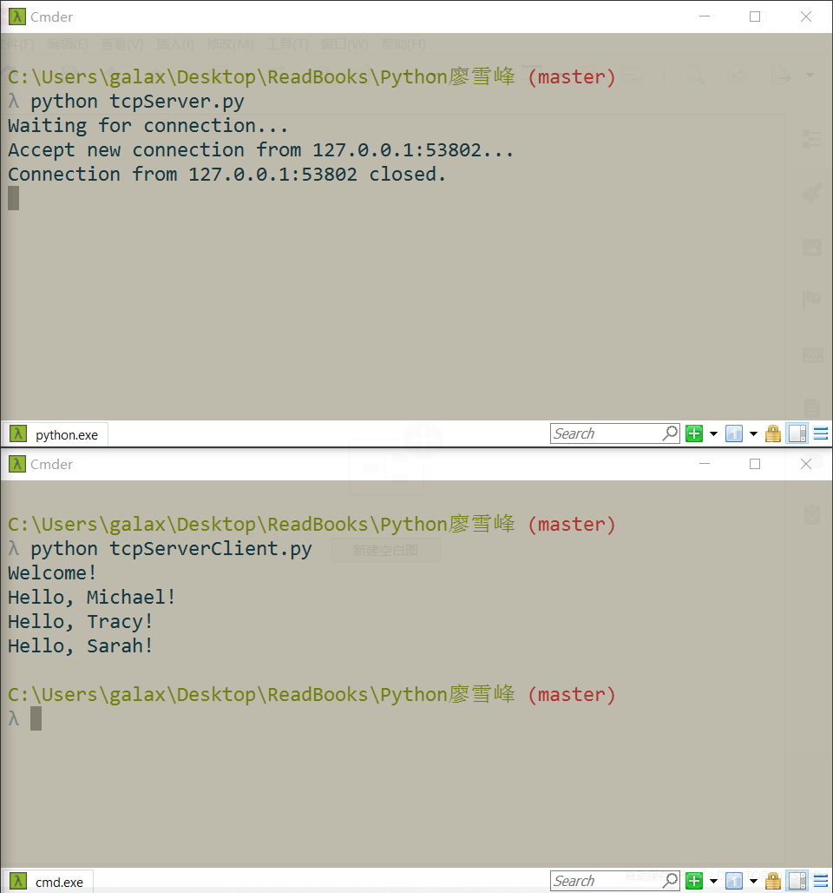
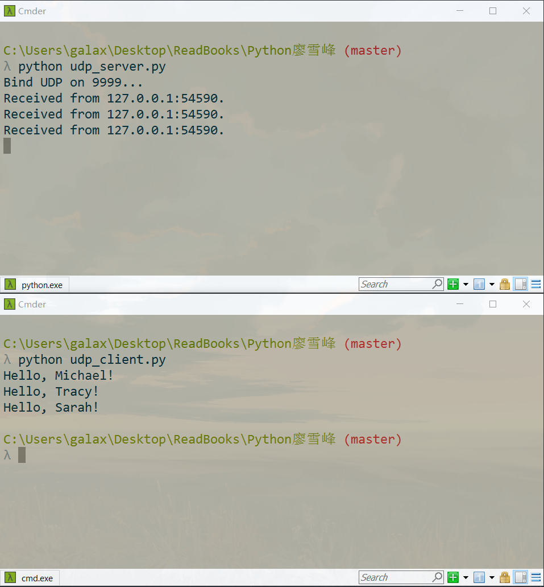

## TCP
源码[https://github.com/yacogo/ReadBooks/](https://github.com/yacogo/ReadBooks/)
### 服务器端
``` python
# 服务器进程首先要绑定一个端口并监听来自其他客户端的连接。
# 如果某个客户端连接过来了，服务器就与该客户端建立Socket连接，
# 随后的通信就靠这个Socket连接了。
# 一个Socket：服务器地址、服务器端口、客户端地址、客户端端口来唯一确定一个Socket。

# 该服务器程序接收客户端连接，把客户端发过来的字符串加上Hello再发回去

import socket
import threading
import time

s = socket.socket(socket.AF_INET,socket.SOCK_STREAM)

# 监听端口:
s.bind(('127.0.0.1', 9999))
s.listen(5)
print('Waiting for connection...')

def tcplink(sock, addr):
    print('Accept new connection from %s:%s...' % addr)
    # 连接建立后，服务器首先发一条欢迎消息
    sock.send(b'Welcome!')
    while True:
        # 等待客户端数据，并加上Hello再发送给客户端
        data = sock.recv(1024)
        time.sleep(1)
        # 如果客户端发送了exit字符串，就直接关闭连接
        if not data or data.decode('utf-8') == 'exit':
            break
        sock.send(('Hello, %s!' % data.decode('utf-8')).encode('utf-8'))
    sock.close()
    print('Connection from %s:%s closed.' % addr)

while True:
    # 接受一个新连接
    # accept()会等待并返回一个客户端的连接
    sock, addr = s.accept()
    # 创建新线程来处理TCP连接:
    # 每个连接都必须创建新线程（或进程）来处理，否则，单线程在处理连接的过程中，无法接受其他客户端的连接
    t = threading.Thread(target=tcplink, args=(sock, addr))
    t.start()
```

### 客户端：
``` python
import socket
# AF_INET指定使用IPv4协议，如果要用更先进的IPv6，就指定为AF_INET6
# SOCK_STREAM指定使用面向流的TCP协议
s = socket.socket(socket.AF_INET, socket.SOCK_STREAM)
# 建立连接:
s.connect(('127.0.0.1', 9999))
# 接收欢迎消息:
print(s.recv(1024).decode('utf-8'))
for data in [b'Michael', b'Tracy', b'Sarah']:
    # 发送数据:
    s.send(data)
    print(s.recv(1024).decode('utf-8'))
s.send(b'exit')
s.close()
```
### 运行结果：

## UDP
### 服务器端：
``` python
# 使用UDP协议时，不需要建立连接，只需要知道对方的IP地址和端口号，就可以直接发数据包。但是，能不能到达就不知道了。
# -*- coding: utf-8 -*-

import socket

s = socket.socket(socket.AF_INET, socket.SOCK_DGRAM)

# 绑定端口:
s.bind(('127.0.0.1', 9999))

print('Bind UDP on 9999...')

while True:
    # 接收数据:
    data, addr = s.recvfrom(1024)
    print('Received from %s:%s.' % addr)
    reply = 'Hello, %s!' % data.decode('utf-8')
    s.sendto(reply.encode('utf-8'), addr)
```

### 客户端：
```
# -*- coding: utf-8 -*-

import socket

s = socket.socket(socket.AF_INET, socket.SOCK_DGRAM)

for data in [b'Michael', b'Tracy', b'Sarah']:
    # 发送数据:
    s.sendto(data, ('127.0.0.1', 9999))
    # 接收数据:
    print(s.recv(1024).decode('utf-8'))

s.close()
```

### 运行结果：
