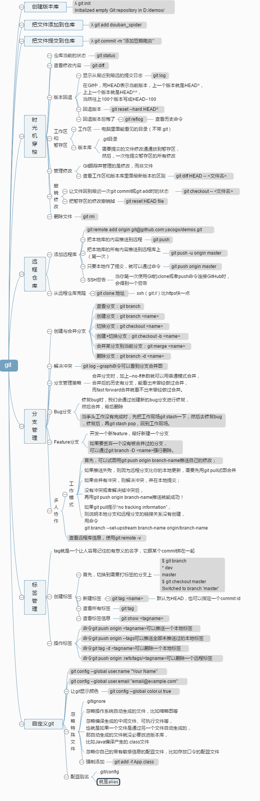

# git

## 创建版本库

### λ git init
Initialized empty Git repository in D:/demos/

## 把文件添加到仓库

### λ git add douban_spider

## 把文件提交到仓库

### λ git commit -m "添加豆瓣爬虫"

## 时
光
机
穿
梭

### 仓库当前的状态

#### git status

### 查看修改内容

#### git diff

### 版本回退

#### 显示从最近到最远的提交日志

##### git log

#### 在Git中，用HEAD表示当前版本，上一个版本就是HEAD^，
上上一个版本就是HEAD^^，
当然往上100个版本写成HEAD~100

#### 回退版本

##### git reset --hard HEAD^

#### 回退版本后悔了

##### git reflog

###### 查看历史命令

### 工作区
和
暂存区

#### 工作区

##### 电脑里面能看见的目录（不带.git）

#### 版本库

##### .git目录

##### 需要提交的文件修改通通放到暂存区，
然后，一次性提交暂存区的所有修改

### 管理修改

#### Git跟踪并管理的是修改，而非文件

#### 查看工作区和版本库里面最新版本的区别

##### git diff HEAD -- <文件名>

### 撤
销
修
改

#### 让文件回到最近一次git commit或git add时的状态

##### git checkout -- <文件名>

#### 把暂存区的修改撤销掉

##### git reset HEAD file

### 删除文件

#### git rm

## 远
程
仓
库

### 添加远程库

#### git remote add origin git@github.com:yacogo/demos.git

#### 把本地库的内容推送到远程

##### git push

#### 把本地库的所有内容推送到远程库上
（第一次）

##### git push -u origin master

#### 只要本地作了提交，就可以通过命令

##### git push origin master

#### SSH警告

##### 当你第一次使用Git的clone或者push命令连接GitHub时，
会得到一个警告

### 从远程仓库克隆

#### git clone 地址

##### ssh（git://）比https快一点

## 分
支
管
理

### 创建与合并分支

#### 查看分支：git branch

#### 创建分支：git branch <name>

#### 切换分支：git checkout <name>

#### 创建+切换分支：git checkout -b <name>

#### 合并某分支到当前分支：git merge <name>

#### 删除分支：git branch -d <name>

### 解决冲突

#### git log --graph命令可以看到分支合并图

### 分支管理策略

#### 合并分支时，加上--no-ff参数就可以用普通模式合并，
合并后的历史有分支，能看出来曾经做过合并，
而fast forward合并就看不出来曾经做过合并。

### Bug分支

#### 修复bug时，我们会通过创建新的bug分支进行修复，
然后合并，最后删除

#### 当手头工作没有完成时，先把工作现场git stash一下，然后去修复bug
，修复后，再git stash pop，回到工作现场。

### Feature分支

#### 开发一个新feature，最好新建一个分支

#### 如果要丢弃一个没有被合并过的分支，
可以通过git branch -D <name>强行删除。

### 多
人
协
作

#### 工
作
模
式

##### 首先，可以试图用git push origin branch-name推送自己的修改；

##### 如果推送失败，则因为远程分支比你的本地更新，需要先用git pull试图合并

##### 如果合并有冲突，则解决冲突，并在本地提交；

##### 没有冲突或者解决掉冲突后，
再用git push origin branch-name推送就能成功！

##### 如果git pull提示“no tracking information”，
则说明本地分支和远程分支的链接关系没有创建，
用命令
git branch --set-upstream branch-name origin/branch-name

#### 查看远程库信息，使用git remote -v

## 标
签
管
理

### tag就是一个让人容易记住的有意义的名字，它跟某个commit绑在一起

### 创建标签

#### 首先，切换到需要打标签的分支上

##### $ git branch
* dev
  master
$ git checkout master
Switched to branch 'master'

#### 新建标签

##### git tag <name>

###### 默认为HEAD，也可以指定一个commit id

#### 查看所有标签

##### git tag

#### 查看标签信息

##### git show <tagname>

### 操作标签

#### 命令git push origin <tagname>可以推送一个本地标签

#### 命令git push origin --tags可以推送全部未推送过的本地标签

#### 命令git tag -d <tagname>可以删除一个本地标签

#### 命令git push origin :refs/tags/<tagname>可以删除一个远程标签

## 自定义git

### git config --global user.name "Your Name"

###  git config --global user.email "email@example.com"

### 让git显示颜色

####  git config --global color.ui true

### 忽
略
特
殊
文
件

#### .gitignore

#### 忽略操作系统自动生成的文件，比如缩略图等

#### 忽略编译生成的中间文件、可执行文件等，
也就是如果一个文件是通过另一个文件自动生成的，
那自动生成的文件就没必要放进版本库，
比如Java编译产生的.class文件

#### 忽略你自己的带有敏感信息的配置文件，比如存放口令的配置文件

#### 强制添加

##### git add -f App.class

### 配置别名

#### .git/config

#### 就是alias
